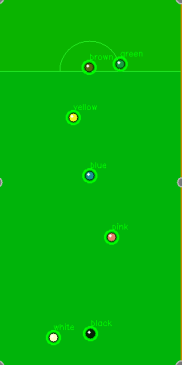

# Snooker Master

## **Introduction:**

The game of snooker requires a combination of skill, precision, and strategy, attracting players of all ages and backgrounds. Meanwhile, this game is quite challenging in accurately aiming and potting balls into the pockets.

Recognizing this universal struggle, our project, Snooker Master, aims to use the power of computer vision to simplify the way players approach the game.

By harnessing advanced techniques such as Perspective Transformation, Hough Transformation, and Pattern Matching, we seek to provide players with real-time visual aids that enhance their decision-making and performance on the snooker table.


## **Goal**

The primary goal of Snooker Master is to develop a sophisticated computer vision system that assists players in optimizing their performance on the snooker table. Our overarching objective is to provide users with a set of functionalities that address the key challenges inherent in snooker gameplay - assessing angles, estimating distances, and predicting ball trajectories.

## Perspective Transformation


**Function 1: Drawing balls on the snooker table:**


The draw_balls() function is designed to visually represent snooker balls on a given background image by processing the contour data of the balls. It starts by creating a filter kernel and copying the background image to use as a canvas. For each contour in the provided list of contours, it computes the centroid of the contour to determine the position of the ball. A temporary mask is updated for each contour to isolate the region of interest, which is then eroded to reduce the influence of any surrounding green color (common in snooker table images). Each ball is then drawn on the canvas at the calculated centroid position with a color derived from the average color within the eroded mask area of the original image. The ball is drawn as a filled circle with additional cosmetic enhancements: a black outline for depth and a small white circle on the upper left to simulate light reflection. The process iterates for all contours, resulting in a final image with all balls drawn over the original background. 


**Function 2: Getting contours & Filtering:**


The filter_ctrs function filters a list of contours based on their geometric properties to identify those representing snooker balls. It initializes an empty list for storing contours that pass the filtering criteria. For each contour in the list, the function calculates the minimum area rectangle that can enclose the contour, deriving the rectangle's width and height. It also computes the contour's area. The function then applies two filtering conditions: first, it checks the aspect ratio of the rectangle; the contour is disregarded if the height multiplied by alpha (a parameter that helps to filter objects by their shapes) is less than the width or vice versa, ensuring the contour is approximately circular and not elongated. Second, it checks whether the contour's area falls within a specified range between min_s and max_s. Contours that fail any of these conditions are skipped, while those passing both conditions are added to the filtered_ctrs list, deemed most likely to represent snooker balls. This process helps isolate ball contours from other irrelevant shapes or noise in images from snooker or pool games.


**Function 3: Enhancing Visual Representation of Snooker Balls:**


The find_ctrs_color() function is designed to process a list of contours representing snooker balls, and visually enhance them by coloring each ball based on the average color within its contour. The function starts by creating a gray-scale version of the input image and initializing an empty mask with the same dimensions. For each contour, it calculates the centroid coordinates using image moments, which determines where to draw the visual representation of the ball on the output image. The mask is reset for each contour and then used to draw and subsequently erode the area of the current contour, effectively reducing interference from nearby colors, particularly green, which is common on pool tables. Each ball is then drawn on the output image as a filled circle at its centroid with a color derived from the mean color within the eroded masked area of the input image. The erosion process helps focus on the central color of each ball, making the visual output more consistent with the actual colors of the balls. This function is useful for creating a visually enhanced representation of each ball, which can aid in further image processing tasks like color-based sorting or identification in-game analysis software.


**Perspective Transformation**


The above is the key procedure for applying a perspective transformation to an image, which consists of two main steps:


1. Defining correspondence points:

2. - pts1 contains the coordinates of four corner points on the original image. These points are selected to define the region of interest or the part of the image that needs transformation.
   - pts2 contains coordinates of where these points should map in the transformed image. These are the corners of the new image dimensions specified by width and height.

3. Calculating transformation matrix:

4. - cv2.getPerspectiveTransform(pts1, pts2) computes the perspective transformation matrix. This matrix is derived such that the points in pts1 from the original image correspond to points in pts2 in the transformed image.

5. Applying the transformation:

6. - cv2.warpPerspective(frame, matrix, (width, height)) applies the transformation matrix to the original image (frame). The result is a new image (transformed) where the perspective is adjusted according to the matrix. The output image has dimensions specified by width and height.

7. 

8. The above left is the original image, and the right is the output transformed image.

9. **Object Isolation through Color Segmentation and Morphological Operations**

10. 

11. 

12. 

13. The above code performs advanced image processing to isolate and highlight objects Initially, the code applies a Gaussian blur to smooth the image, reducing noise for more effective processing. It then converts the color space from BGR to RGB, and subsequently to HSV for color segmentation. The specific green hue of the snooker table is targeted using a defined HSV range, and a binary mask is created to isolate this color. To enhance the segmentation, a morphological closing operation (dilation followed by erosion) is applied to close gaps in the detected table area. The mask is then inverted to focus on objects lying on the table, excluding the table itself. Finally, the inverted mask is applied to the original transformed image, effectively highlighting only the objects on the table and making them stand out against a suppressed background.

14. 

15. 

16. 

17. The above steps detect and visualize objects through contour detection, filtering, and color analysis techniques. First, it identifies all potential objects using contour detection on an inverted mask that highlights these objects against the snooker table background. Next, the contours are visually marked and then filtered to discard any that don't meet predefined size or shape standards. The remaining contours are then analyzed to determine the average color. Finally, this colored contour image is blended with the transformed image to enhance the objects and their context, providing a clear and informative visualization.

18. 

19. 

20. 

21. 

22. 

23. The above right is the final refined transformed 2D image with all snooker balls drawn based on the original frame.

24. 

## Identify the balls

As a popular ball game, snooker puts forward certain requirements for ball color recognition in competition and training scenarios. Correctly identifying the color of billiard balls is not only crucial to the fairness of game referees, but also enhances viewing pleasure and improves training efficiency.


Traditionally, this work has relied on manual execution, but this approach is time-consuming and can be affected by human error. Therefore, it is particularly important to develop an automated ball color recognition system that can accurately identify the ball color on the table in real time, support game referees and training feedback, and improve efficiency and accuracy.


### Define the color range of various balls

Identifying the color of balls can help determine the type of ball and its corresponding color in an automated system. We used the HSV color space to define the color range of various billiard balls. The HSV color model is more intuitive and effective than the RGB model in processing real-world colors, especially in color segmentation and object tracking. In the code, we define a dictionary named `color_ranges`, which contains the HSV ranges of balls of different colors. Each color label corresponds to a pair of HSV values that define the minimum and maximum range of the color. The specific colors and their corresponding HSV ranges are as follows:

```python
color_ranges = {
    'blue': ((25, 70, 50), (35, 255, 255)),
    'yellow': ((85, 210, 240), (95, 220, 250)),
    'green': ((50, 210, 150), (60, 220, 160)),
    'brown': ((80, 190, 100), (90, 200, 110)),
    'pink': ((110, 130, 220), (120, 140, 230)),
    'black': ((50, 200, 30), (60, 210, 40)),
    'white': ((80, 50, 250), (100, 70, 255))
}
```

`color_ranges` can be used in image processing to identify and classify billiard balls of different colors by comparing whether the HSV value of each pixel in the image falls within the range defined above. By precisely defining the color range of billiard balls, we can effectively automatically identify the color of billiard balls in digital images, thereby improving game interactivity and viewing.


### Identify the color of balls on a 2D table

Previously we defined the HSV range for various billiard ball colors, next we need to preprocess the images in order to identify balls of specific colors in these images.

```python
hsv_image = cv2.cvtColor(image_2d, cv2.COLOR_BGR2HSV)
```

We use the `cv2.cvtColor` function of the OpenCV library to convert the image from BGR color space to HSV color space. In computer vision, BGR is the default color space format and the HSV color space is better suited for color recognition:

- Hue: the type of color
- Saturation: the intensity or purity of a color
- Value: the brightness of the color

By converting to the HSV color space, we can more easily identify colors with simple range checks.


### Contour detection and calculation of the center of the ball

For each defined color range, we need to filter the image using a color mask, and then use contour detection to find balls of the corresponding color in the image. Only when the detected contour area is large enough, it is considered to be a valid sphere contour. We calculate the position of its center of mass from the effective contour, and this information is used to determine the center of the ball for subsequent marking.

```python
# Store recognition results
balls_detected = []

for color_name, (lower, upper) in color_ranges.items():
    # Create a color mask
    mask = cv2.inRange(hsv_image, np.array(lower), np.array(upper))

    # Find contours in mask
    contours, _ = cv2.findContours(mask, cv2.RETR_EXTERNAL, cv2.CHAIN_APPROX_SIMPLE)

    # Iterate through all contours and calculate their centroid
    for contour in contours:
        area = cv2.contourArea(contour)
        if area > 50:
            M = cv2.moments(contour)
            if M['m00'] != 0:
                # Calculate center of ball
                cx = int(M['m10'] / M['m00'])
                cy = int(M['m01'] / M['m00'])
                balls_detected.append((cx, cy, color_name))
                
balls_detected
```

After repeating this process across all color ranges, `balls_detected` list will contain the center coordinates and corresponding colors of all detected balls. This information can be used for further image analysis or to provide visual aids in game tracking systems.


Finally, we draw a circle at the location of each detected billiard ball and label the ball's color name.

```python
# Draw a circle to mark the position of the ball and write the color name of the ball
for (x, y, color_name) in balls_detected:
    cv2.circle(marked_image, (x, y), 10, (0, 255, 0), 2)
    cv2.putText(marked_image, color_name, (x, y - 12), cv2.FONT_HERSHEY_SIMPLEX, 0.4, (0, 255, 0), 1)
```

We can get the billiards picture on the two-dimensional table and the corresponding identification content, including location information and color, etc.




## Generate the path

In the final step, we are going to take aim. On the snooker table, to finish a hit, we have three main components. The cue ball, the target ball and the pot. Basically, we need to determine a ball as our target and choose a pot that is suitable for the target to get in. 


First, let's review the basic rules of snooker. The only ball we can hit is the cue ball which is known as the white ball. We hit the cue ball, then it starts to move. During its moving, it hits other balls and our goal is to make them roll into a pot one by one. 


The basic situation is shown in the folloing illustration. 


Three main components are in the same line. Intuitively, we will choose to hit the cue ball in the same direction as the line. 


But, **what if they are randomly located on the table?**  I have to say this is the most common situation on the snooker table.  See below.


What strategy should we take now?


Our solution is to find the **hitting point** first. The so called hitting point is the position where the cue ball should hit our target ball. How to find it? Basically, it should be the **tanget circle** of our taget ball and the center of it should also be on the same line given by the target ball and the pot.  


So how to calculate the center of the tanget circle.

See the illustatraion below.


Given the Target $(x_1, y_1)$, Pot $(x_0, y_0)$, and the line function between them $y = kx + b$ , $k = \frac{x_1-x_0}{y_1-y_0}$

the equation for the Hitting point $(x_2, y_2)$ is:

$x_2 = x_1 + \frac{d}{\sqrt{1+k^2}}$

$y_2 = y_1 + \frac{dk}{\sqrt{1+k^2}}$


Then we connect the hitting point and the cue ball. This direction will be the one that we will take.


**Wait! What if there is a ball blocking the way?**


### Show time! Play a bank shot!


But, how to find the bank point ?

The principle behind this: **Incidence angle equals reflection angle**.

Thanks to the fundamental law of reflection, we have two similar tiangles here. Given this fact, it is not difficult to find the bank point. Hitting Point $(x_1, y_1)$, Cue Ball$(x_2, y_2)$

$\frac{x_1}{x_2} = \frac{a}{b}$

$a+b = y_2-y_1$

so $a = \frac{x_1(y_2-y_1)}{x_1+x_2} $

Bank Point's position (in this situation)will be $(0, y_1 + \frac{x_1(y_2-y_1)}{x_1+x_2})$

The equation will be slightly different when the border is located at the right, up or botton.


### Play it !

We designed an interactive user interface in our jyupter notebook.  Choose the target ball and the pot. We will generate the path for you. 


Show your "brilliant skills" by using our Snooker Master !!


